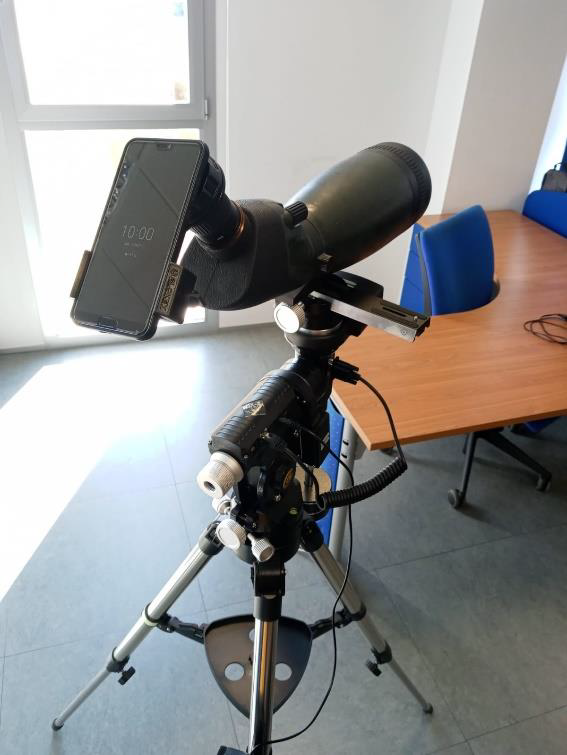

# Structural Health Monitoring of Wind Turbines

The general objective of this project has been to develop a preventive maintenance system for wind turbines based on deep computational learning techniques, specifically in the field of computer vision. The system consists of a mobile application that makes use of a telescope to take precise photographs of the turbine blades and a motorized mount that allows the movement of the telescope.

This project aims to detect and classify possible surface damages in wind turbine blades in order to facilitate and improve the inspection of said systems. The final application tries to carry out a complete sweep of the surface of the wind turbine blades in a semi-autonomous way and finally presents the defects found to the user.

In order to do this, an Android application has been developed that allows you to capture images of the wind turbines and control the motorized mount, as well as models of convolutional neural networks which process those images, thus allowing you to model and predict the behavior and possible breakdowns of the components involved.

## Complete system

